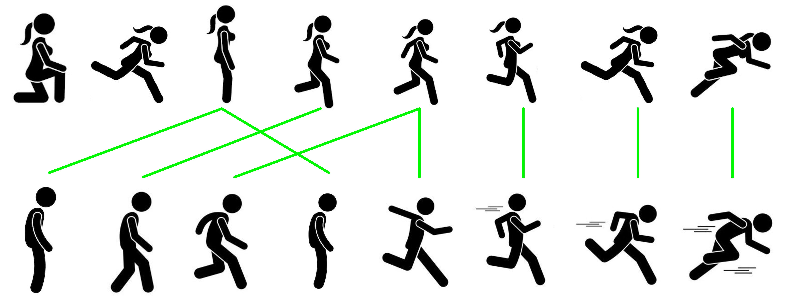

# Code for "Learning to Align Sequential Actions in the Wild" (CVPR 2022)

This repository is a TensorFlow implementation for the paper **Learning to Align Sequential Actions in the Wild**. Weizhe Liu, Bugra Tekin, Huseyin Coskun, Vibhav Vineet, Pascal Fua, Marc Pollefeys. CVPR. 2022 . If you use this code in your research, please cite
[the paper](https://arxiv.org/pdf/2111.09301.pdf).


State-of-the-art methods for self-supervised sequential action alignment rely on deep networks that find correspondences across videos in time. They either learn frame-toframe mapping across sequences, which does not leverage temporal information, or assume monotonic alignment between each video pair, which ignores variations in the order of actions. As such, these methods are not able to deal with common real-world scenarios that involve background frames or videos that contain non-monotonic sequence of actions.

In this paper, we propose an approach to align sequential actions in the wild that involve diverse temporal variations. To this end, we propose an approach to enforce temporal priors on the optimal transport matrix, which leverages temporal consistency, while allowing for variations in the order of actions. Our model accounts for both monotonic and non-monotonic sequences and handles background frames that should not be aligned. We demonstrate that our approach consistently outperforms the stateof-the-art in self-supervised sequential action representation learning on four different benchmark datasets.



Figure 1: **Alignment Priors:** our approach, VAVA, enforces temporal priors to address non-monotonic frames and gracefully handles unmatched frames (e.g. crouching position in the first sequence), resulting in accurate alignment between sequences.

## Installation
```
pip install -r requirements.txt
```

## Dataset

&emsp;1. Download COIN Dataset from [here](https://coin-dataset.github.io/) 

&emsp;2. We follow previous work to preprocess the dataset, please refer to this [script](https://github.com/google-research/google-research/blob/master/tcc/dataset_preparation/images_to_tfrecords.py) for dataset preparation

## VAVA Implementation

Coming soon.

## How to Use

Coming soon.
 
## Citing

``` 
@InProceedings{Liu_2022_CVPR,

author = {Weizhe Liu and Bugra Tekin and Huseyin Coskun and Vibhav Vineet and Pascal Fua and Marc Pollefeys},

title = {Learning to Align Sequential Actions in the Wild},

booktitle = {The IEEE Conference on Computer Vision and Pattern Recognition (CVPR)},

month = {June},

year = {2022}

}

``` 


## Contact

For any questions regard this paper/code, please directly contact [Weizhe Liu](mailto:weizheliu1991@163.com).

